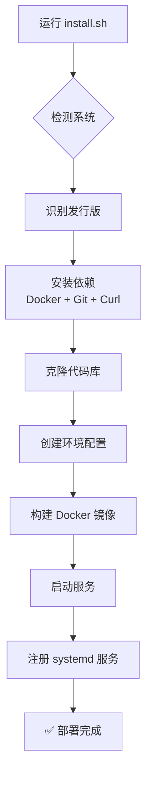
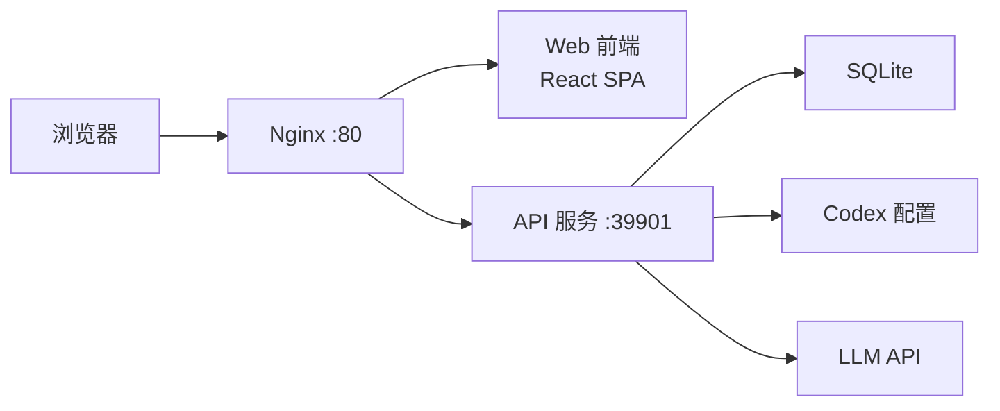

# Codex++ Web

> 将 [CodexPlusPlus](https://github.com/BigPizzaV3/CodexPlusPlus) 从 Tauri 桌面 GUI 改造为 **Web 界面 + Docker Compose** 部署的 LLM 管理平台。
>
> 让 Codex 可以轻松接入各类 LLM（OpenAI、DeepSeek、GLM、Kimi、Qwen 等）并随时切换。

---

## 📋 目录

- [快速部署](#-快速部署)
- [系统要求](#-系统要求)
- [一键部署脚本](#-一键部署脚本)
- [Linux 发行版适配](#-linux-发行版适配)
- [Docker 部署](#-docker-部署)
- [开发模式](#-开发模式)
- [使用说明](#-使用说明)
- [API 文档](#-api-文档)
- [项目结构](#-项目结构)
- [技术栈](#-技术栈)
- [常见问题](#-常见问题)

---

## 🚀 快速部署

### 一键部署（推荐）

**Ubuntu / Debian:**
```bash
curl -sL https://raw.githubusercontent.com/michaellab7284/codex-plus-web/main/install.sh | sudo bash -s install
```

**CentOS / RHEL / Fedora:**
```bash
curl -sL https://raw.githubusercontent.com/michaellab7284/codex-plus-web/main/install.sh | sudo bash -s install
```

**Arch Linux / Manjaro:**
```bash
curl -sL https://raw.githubusercontent.com/michaellab7284/codex-plus-web/main/install.sh | sudo bash -s install
```

**Alpine Linux:**
```bash
apk add curl bash
curl -sL https://raw.githubusercontent.com/michaellab7284/codex-plus-web/main/install.sh | bash -s install
```

### Docker Compose 部署

```bash
# 1. 克隆项目
git clone --depth 1 https://github.com/michaellab7284/codex-plus-web.git
cd codex-plus-web

# 2. 配置环境变量
cp .env.example .env

# 3. 一键启动
docker compose up -d --build

# 4. 访问
open http://localhost
```

---

## 📦 系统要求

| 组件 | 版本要求 |
|------|---------|
| Linux 内核 | 3.10+ (推荐 5.x+) |
| Docker | 24.0+ |
| Docker Compose | v2.20+ (或 docker-compose-plugin) |
| Git | 2.x+ |
| 内存 | 最少 512MB (推荐 1GB+) |
| 磁盘 | 最少 1GB 可用空间 |

### 支持的 Linux 发行版

| 发行版 | 支持状态 | 包管理器 |
|--------|---------|---------|
| Ubuntu 20.04+ | ✅ 完美支持 | apt |
| Debian 11+ | ✅ 完美支持 | apt |
| CentOS 7+ | ✅ 支持 | yum/dnf |
| Rocky Linux 8+ | ✅ 支持 | dnf |
| AlmaLinux 8+ | ✅ 支持 | dnf |
| Fedora 36+ | ✅ 支持 | dnf |
| Arch Linux | ✅ 支持 | pacman |
| Manjaro | ✅ 支持 | pacman |
| openSUSE Leap 15+ | ✅ 支持 | zypper |
| Alpine 3.18+ | ✅ 支持 | apk |
| Deepin/UOS | ✅ 支持 (基于 Debian) | apt |
| Amazon Linux 2+ | ✅ 支持 | yum |

---

## 📜 一键部署脚本

### 交互式菜单

```bash
# 下载并运行
bash <(curl -sL https://raw.githubusercontent.com/michaellab7284/codex-plus-web/main/install.sh)
```

菜单选项：
```
╔══════════════════════════════════════════╗
║        Codex++ Web 管理菜单              ║
╚══════════════════════════════════════════╝

  1. 一键安装 (Install)
  2. 一键卸载 (Uninstall)
  3. 查看状态 (Status)
  4. 更新升级 (Update)
  5. 退出 (Exit)
```

### 静默命令

```bash
# 安装
sudo bash install.sh install

# 卸载
sudo bash install.sh uninstall

# 查看状态
sudo bash install.sh status

# 更新
sudo bash install.sh update
```

### 部署脚本工作流程



---

## 🐳 Docker 部署

### 架构



### 服务端口

| 服务 | 端口 | 说明 |
|------|------|------|
| Nginx (Web) | `80` | 前端页面 + API 反向代理 |
| API | `39901` | Rust Axum REST API |

### 环境变量

| 变量 | 默认值 | 说明 |
|------|--------|------|
| `API_HOST` | `0.0.0.0` | API 监听地址 |
| `API_PORT` | `39901` | API 监听端口 |
| `RUST_LOG` | `info` | 日志级别 (debug/info/warn/error) |
| `CODEX_HOME` | `~/.codex` | Codex 配置目录 (bind mount) |
| `CODEX_STATE` | `~/.codex-session-delete` | Codex++ 状态目录 (bind mount) |

### 数据持久化

```yaml
volumes:
  codex-home:      # ~/.codex → config.toml, auth.json
  codex-state:     # ~/.codex-session-delete → 状态/日志
  codex-data:      # /data → 应用数据
```

---

## 💻 开发模式

### 前置要求

- Rust 1.85+ (安装: `curl --proto '=https' --tlsv1.2 -sSf https://sh.rustup.rs | sh`)
- Node.js 22+ (安装: `nvm install 22`)
- Docker 24+

### 启动 API 服务

```bash
cd web-api

# 开发运行
cargo run

# 特定端口
cargo run -- --port 39901

# CLI 命令
cargo run -- health
cargo run -- settings get
cargo run -- relay list
cargo run -- sessions --list
```

### 启动前端开发服务器

```bash
cd web-ui

# 安装依赖
npm install

# 开发运行 (自动代理 API 请求到 :39901)
npm run dev

# 构建生产版本
npm run build
```

### 验证 API

```bash
# 健康检查
curl http://localhost:39901/api/health

# 获取设置
curl http://localhost:39901/api/settings

# 获取供应商预设
curl http://localhost:39901/api/providers/presets
```

---

## 🎯 使用说明

### 概览页面

部署完成后访问 `http://localhost`，进入概览页面：

- **启动状态**: 查看 Codex 进程运行状态
- **快速操作**: 一键进入供应商配置、会话管理、页面增强

### 供应商配置

在「供应商配置」页面可以：

1. **添加供应商**: 选择预设模板（OpenAI、DeepSeek、GLM、Kimi 等）
2. **配置中转**: 填写 Base URL 和 API Key
3. **切换供应商**: 一键切换当前使用的 LLM
4. **测试连接**: 验证配置是否可用

### 会话管理

在「会话管理」页面：

- 查看所有本地 Codex 会话
- 删除不需要的会话
- 刷新会话列表

### 页面增强

在「页面增强」页面可以开启/关闭各种增强功能：

| 功能 | 说明 |
|------|------|
| 插件入口解锁 | 解锁 API Key 模式下的插件入口 |
| 插件市场解锁 | 解锁插件市场功能 |
| 会话删除 | 在会话列表添加删除按钮 |
| Markdown 导出 | 导出会话为 Markdown |
| 粘贴修复 | 从富文本粘贴时只保留纯文本 |

---

## 📡 API 文档

### 健康检查

```bash
GET /api/health
```
```json
{"status":"ok","version":"1.2.18","service":"codex-plus-web-api"}
```

### 后端状态

```bash
GET /api/status
```

### 设置管理

```bash
# 获取设置
GET /api/settings

# 更新设置
PUT /api/settings
Content-Type: application/json

{"codexAppPath": "/Applications/Codex.app"}
```

### 中转配置 (Relay Profiles)

```bash
# 列表
GET /api/relay/profiles

# 创建
POST /api/relay/profiles
Content-Type: application/json

{"name":"DeepSeek","baseUrl":"https://api.deepseek.com","protocol":"chatCompletions","relayMode":"pureApi"}

# 查看
GET /api/relay/profiles/{id}

# 更新
PUT /api/relay/profiles/{id}

# 删除
DELETE /api/relay/profiles/{id}

# 切换
POST /api/relay/switch
{"profileId": "deepseek"}

# 应用中转
POST /api/relay/apply

# 清除中转
POST /api/relay/clear

# 测试连接
POST /api/relay/test
{"baseUrl":"https://api.deepseek.com","apiKey":"sk-xxx"}
```

### 会话管理

```bash
# 列表
GET /api/sessions

# 删除
DELETE /api/sessions/{id}
```

### 增强功能

```bash
# 获取
GET /api/enhancements

# 更新
PUT /api/enhancements
{"codexAppSessionDelete": true}
```

### WebSocket

```bash
# 连接
ws://localhost:39901/ws
```

---

## 📁 项目结构

```
codex-plus-web/
├── .github/workflows/        # GitHub Actions CI/CD
│   └── docker.yml            # 自动构建 Docker 镜像
├── web-api/                  # 🦀 Rust Axum API 服务
│   ├── src/
│   │   ├── main.rs           # CLI + Server 入口
│   │   ├── cli.rs            # 命令行参数
│   │   ├── state.rs          # 共享状态
│   │   ├── ws.rs             # WebSocket
│   │   └── routes/           # REST API 路由 (18 端点)
│   ├── tests/                # 集成测试
│   ├── Cargo.toml
│   └── Dockerfile            # 多阶段构建
├── web-ui/                   # ⚛️ React 19 + Vite 前端
│   ├── src/
│   │   ├── api/client.ts     # API 客户端
│   │   ├── App.tsx           # 主应用 (5 个页面)
│   │   └── components/       # UI 组件
│   ├── package.json
│   └── Dockerfile
├── nginx/                    # 反向代理配置
│   └── default.conf
├── install.sh                # 🚀 一键部署脚本
├── docker-compose.yml        # Docker 编排
├── .env.example              # 环境变量模板
└── CodexPlusPlus/            # 原始项目 (Rust 依赖)
```

---

## ⚙️ 技术栈

| 层 | 技术 |
|------|--------|
| **后端** | Rust + Axum 0.8 + Tokio |
| **前端** | React 19 + TypeScript + Vite 6 + Tailwind CSS 4 |
| **核心** | codex-plus-core (CDP 注入、LLM 切换、配置管理) |
| **数据** | SQLite + JSON 文件系统 |
| **容器** | Docker + Docker Compose |
| **CI/CD** | GitHub Actions → ghcr.io |
| **部署** | 一键脚本 (支持 10+ Linux 发行版) |

---

## ❓ 常见问题

### Q: 部署后访问不了？

```bash
# 检查服务状态
sudo bash install.sh status

# 查看日志
docker compose logs -f
```

### Q: 如何修改 API 端口？

编辑 `.env` 文件或直接设置环境变量：
```bash
export API_PORT=39901
docker compose up -d
```

### Q: 数据存在哪里？

- Codex 配置: `~/.codex/config.toml`
- 登录状态: `~/.codex/auth.json`
- 会话数据: `~/.codex/sqlite/*.db`
- 应用状态: `~/.codex-session-delete/`

### Q: 为什么某些功能不可用？

Web 版基于浏览器运行，部分桌面专属功能（环境变量管理、文件 Watcher 等）受限于浏览器安全模型。这些功能可通过后端 API 间接使用。

### Q: 如何更新到最新版？

```bash
# 一键更新
sudo bash install.sh update

# 或手动更新
cd /opt/codex-plus-web
git pull
docker compose up -d --build
```

---

## 📄 License

MIT © 2026 [michaellab7284](https://github.com/michaellab7284)

---

*基于 [CodexPlusPlus](https://github.com/BigPizzaV3/CodexPlusPlus) v1.2.18 改造*
