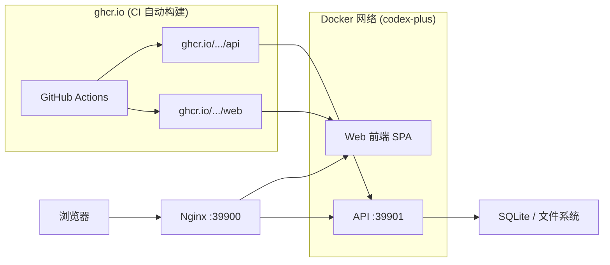
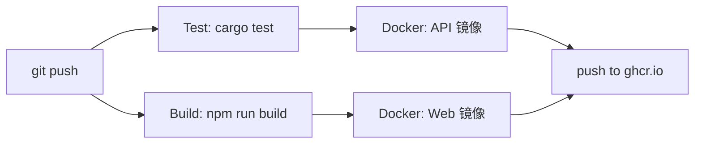

# Codex++ Web

> 将 [CodexPlusPlus](https://github.com/BigPizzaV3/CodexPlusPlus) 从 Tauri 桌面 GUI 改造为 **Web 界面 + Docker** 部署的 LLM 管理平台。
>
> **镜像由 GitHub Actions CI 自动构建**，你只需要一个 `docker` 命令即可运行。

---

## 🚀 一键部署

### 交互式菜单 (推荐)

```bash
bash <(curl -sL https://raw.githubusercontent.com/michaellab7284/codex-plus-web/main/install.sh)
```

```
╔══════════════════════════════════════════╗
║        Codex++ Web 管理菜单              ║
║  镜像: ghcr.io (CI 自动构建)             ║
╚══════════════════════════════════════════╝

  1. 一键安装
  2. 一键卸载
  3. 查看状态
  4. 更新升级
  5. 退出
```

### 静默命令

```bash
# Ubuntu / Debian
curl -sL https://raw.githubusercontent.com/michaellab7284/codex-plus-web/main/install.sh | sudo bash -s install

# CentOS / RHEL / Fedora
curl -sL https://raw.githubusercontent.com/michaellab7284/codex-plus-web/main/install.sh | sudo bash -s install

# Arch Linux / Manjaro
curl -sL https://raw.githubusercontent.com/michaellab7284/codex-plus-web/main/install.sh | sudo bash -s install

# Alpine Linux (先装 bash)
apk add curl bash
curl -sL https://raw.githubusercontent.com/michaellab7284/codex-plus-web/main/install.sh | bash -s install
```

### 纯 Docker 命令

```bash
# 1. 创建网络
docker network create codex-plus

# 2. 启动 API (端口 39901)
docker run -d --name api --network codex-plus --restart unless-stopped \
  -p 39901:39901 \
  -e API_HOST=0.0.0.0 -e API_PORT=39901 -e CODEX_PLUS_DATA_DIR=/data \
  -v ${HOME}/.codex:/root/.codex \
  -v ${HOME}/.codex-session-delete:/root/.codex-session-delete \
  ghcr.io/michaellab7284/codex-plus-web-api:latest

# 3. 启动 Web 前端 (端口 39900)
docker run -d --name web --network codex-plus --restart unless-stopped \
  -p 39900:39900 \
  ghcr.io/michaellab7284/codex-plus-web-web:latest

# 4. 访问 http://localhost
```

---

## 🐳 架构



| 服务 | 镜像 | 端口 | 说明 |
|------|------|------|------|
| **API** | `ghcr.io/.../codex-plus-web-api` | `39901` | Rust Axum REST API |
| **Web** | `ghcr.io/.../codex-plus-web-web` | `39900` | Nginx + React SPA |

---

## 📦 系统要求

- Linux 内核 3.10+
- Docker 24.0+ (安装: `curl -fsSL https://get.docker.com | bash`)
- 内存 512MB+, 磁盘 1GB+

### 支持的发行版

| 发行版 | 包管理器 |
|--------|---------|
| Ubuntu 20.04+, Debian 11+ | apt |
| CentOS 7+, Rocky 8+, Alma 8+ | yum/dnf |
| Fedora 36+ | dnf |
| Arch Linux, Manjaro | pacman |
| Alpine 3.18+ | apk |
| openSUSE Leap 15+ | zypper |

---

## 🎯 使用说明

### 概览页面

访问 `http://localhost` 查看启动状态和快速操作入口。

### 供应商配置

选择预设模板 (OpenAI, DeepSeek, GLM, Kimi 等)，填写 Base URL 和 API Key，一键切换 LLM。

### 会话管理

查看和删除本地 Codex 会话。

### 页面增强

| 功能 | 说明 |
|------|------|
| 插件入口解锁 | 解锁 API Key 模式下的插件入口 |
| 会话删除 | 添加删除按钮 |
| Markdown 导出 | 导出会话为 Markdown |
| 粘贴修复 | 从富文本粘贴时只保留纯文本 |

---

## 📡 API 文档

| 方法 | 路径 | 说明 |
|------|------|------|
| `GET` | `/api/health` | 健康检查 |
| `GET` | `/api/status` | 后端状态 |
| `GET/PUT` | `/api/settings` | 设置管理 |
| `GET` | `/api/relay/profiles` | 中转配置列表 |
| `POST` | `/api/relay/profiles` | 创建配置 |
| `PUT/DELETE` | `/api/relay/profiles/{id}` | 更新/删除 |
| `POST` | `/api/relay/switch` | 切换供应商 |
| `POST` | `/api/relay/apply` | 应用中转注入 |
| `POST` | `/api/relay/clear` | 清除中转注入 |
| `POST` | `/api/relay/test` | 测试连接 |
| `GET` | `/api/sessions` | 会话列表 |
| `DELETE` | `/api/sessions/{id}` | 删除会话 |
| `GET/PUT` | `/api/enhancements` | 增强功能 |
| `GET` | `/api/providers/presets` | 供应商预设 |
| `GET` | `/api/logs` | 日志查看 |
| `WS` | `/ws` | WebSocket |

---

## ⚙️ 镜像构建 (CI/CD)

代码推送到 GitHub 后，**GitHub Actions 自动执行**:



镜像地址: `ghcr.io/michaellab7284/codex-plus-web-{api,web}:latest`

---

## ❓ 常见问题

### 安装脚本做了什么？

1. 检测系统 → 安装 Docker → 从 ghcr.io 拉取镜像 → 启动 2 个容器

### 数据存在哪里？

| 路径 | 内容 |
|------|------|
| `~/.codex/` | Codex 配置 (config.toml, auth.json) |
| `~/.codex-session-delete/` | Codex++ 状态和日志 |
| `/tmp/codex-plus-data/` | 应用数据 |

### 如何更新？

```bash
sudo bash install.sh update
# 或: docker pull ghcr.io/... && docker rm -f api web && bash install.sh install
```

### 如何自定义端口？

```bash
export API_PORT=39999 WEB_PORT=39902
bash install.sh install
```

---

## 📄 License

MIT © 2026 [michaellab7284](https://github.com/michaellab7284)
